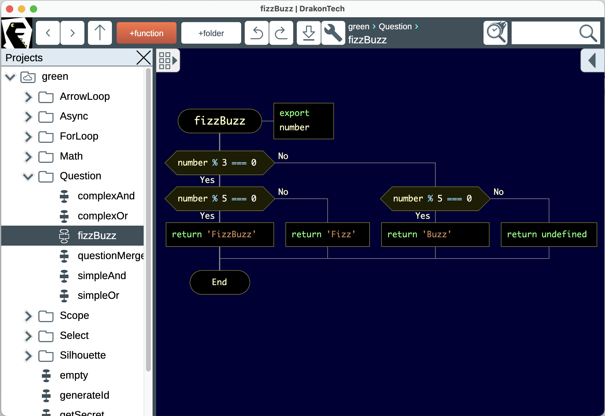

# DrakonTech

A Visual IDE for JavaScript Development

[DrakonTech's homepage](https://drakon.tech/)

__DrakonTech__ is an Integrated Development Environment (IDE) designed to generate JavaScript code from flowcharts using the __DRAKON visual algorithmic language__. The DRAKON language emphasizes clarity and consistency, making it suitable for creating clean and readable flowcharts that directly translate into executable code.

DrakonTech is available for __Windows__, __macOS__, and __Linux__, and provides a streamlined way to build programs by visually defining algorithms. Each flowchart represents a JavaScript function, and the IDE generates the code automatically.

This tool is designed to make visual programming intuitive and efficient, with a focus on making algorithms easy to understand.

## Get DrakonTech

- [Run DrakonTech in the browser](https://stepan-mitkin.github.io/drakon.tech.desktop/run)
- [Download DrakonTech from GitHub releases](https://github.com/stepan-mitkin/drakon.tech.desktop/releases/)