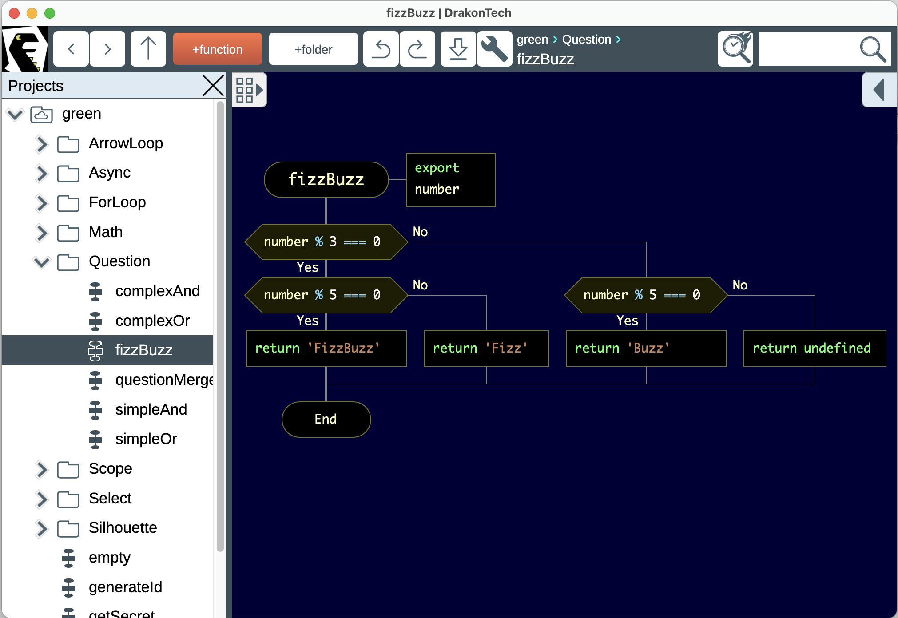

# DrakonTech

DrakonTech is a development environment that generates programs from diagrams written in the Drakon visual language.

Building diagrams in DrakonTech is fast and easy. The flowchart editor in DrakonTech eliminates the need for manual drawing. The user specifies the intent ("add a step," "switch a branch"), and the program automatically arranges the elements.

DrakonTech generates source code in several languages:

- JavaScript
- Lua
- Clojure
- Перфолента.Net
- OneScript/1C:Enterprise

DrakonTech generates not only functions but also classes and finite state machines.

## How to program in DrakonTech

1. Create a project. DrakonTech will create a separate folder for the project. The project file in DrakonTech has the .dtproj extension.
1. Select the target programming language.
Create Drakon diagrams in the project. DrakonTech will convert each diagram into a function in the selected language.
1. Insert short snippets of linear code in the selected programming language into the Drakon diagram elements. Avoid using "if-else" statements or loops keywords. Use the diagram's visual structure to define the algorithm's logic.
1. Click the "Build" button. DrakonTech will generate a source code file based on the diagrams.
1. Include the generated source code file in your program.

## Download DrakonTech

DrakonTech runs on __Windows__, __macOS__, and __Linux__.

- [Download DrakonTech from GitHub releases](https://github.com/stepan-mitkin/drakon.tech.desktop/releases/)

## Run DrakonTech Without Executables

If you're wary of unknown executables, or if your architecture isn't supported, you can run DrakonTech from source without building.

1. Download the DrakonTech source code.
1. Install __NodeJS__.
1. Globally install the __electron__ npm package: __npm install -g electron__
1. Go to the DrakonTech source code folder.
1. Run the __runme__ file or the following command: __electron src/main.js__

## Production Status

DrakonTech is a research project. However, it is fully functional. DrakonTech was used to develop [DrakonWidget library](https://github.com/stepan-mitkin/drakonwidget) and [DrakonHub app](https://drakonhub.com/).

## .drakon File Format

DrakonTech stores Drakon flowcharts in .drakon files. DrakonTech's .drakon files contain a subset of DrakonWidget's JSON-based file format. Its structure is simple and [well-documented](https://github.com/stepan-mitkin/drakonwidget#diagram-data-model).

## License

Public domain.

## Contact the Author

[drakon.editor@gmail.com](mailto:drakon.editor@gmail.com)